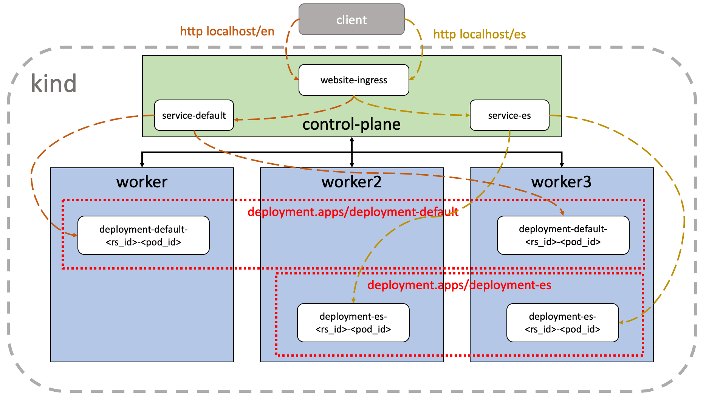

# Kubernetes Ingress Demo

<!-- markdown-link-check-disable-next-line -->

<!-- markdown-link-check-disable-next-line -->

## Summary

This project was created to demonstrate how to configure and use the
[Kubernetes Ingress resource][1]. This demo uses [NGINX][2] or [Contour][3] as
Ingress Controller and the [KinD tool][4] for deploying a multinode Kubernetes
cluster.

## Virtual Machines

The [Vagrant tool][5] can be used for provisioning an Ubuntu Focal
Virtual Machine. It's highly recommended to use the _setup.sh_ script
of the [bootstrap-vagrant project][6] for installing Vagrant
dependencies and plugins required for this project. That script
supports two Virtualization providers (Libvirt and VirtualBox) which
are determine by the **PROVIDER** environment variable.

    curl -fsSL http://bit.ly/initVagrant | PROVIDER=libvirt bash

Once Vagrant is installed, it's possible to provision a Virtual
Machine using the following instructions:

    vagrant up

The provisioning process will take some time to install all
dependencies required by this project and perform a Kubernetes
deployment on it.

### Environment variables

| Name               | Description                                                |
| :----------------- | :--------------------------------------------------------- |
| DEBUG              | Enable verbose output during the execution.(Boolean value) |
| INGRESS_CONTROLLER | Determine the Ingress Controller to be used.(String value) |

[1]: https://kubernetes.io/docs/concepts/services-networking/ingress/
[2]: https://kubernetes.github.io/ingress-nginx/
[3]: https://projectcontour.io/
[4]: https://kind.sigs.k8s.io/
[5]: https://www.vagrantup.com/
[6]: https://github.com/electrocucaracha/bootstrap-vagrant
